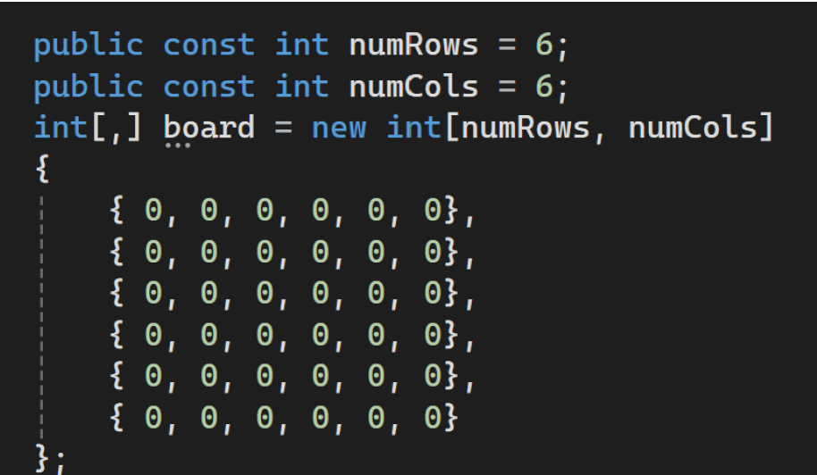

# IAPentagoGame
## Introduction
Pentago is a game for two players played on a board with 36 squares, arranged in a 6x6 grid. The board is divided into four smaller 3x3 grids. Each turn, players place a marble of their color on the board and then rotate a small square by a quarter turn to the right or left.  
The game ends when a player lines up 5 marbles. It can also end without a winner if all the squares are full without a line of five marbles, or if both players make a line of 5 marbles at the same time.  
The goal of this project is to implement the Minimax algorithm, optimized with alpha-beta pruning, for the game Pentago. To develop this game, I used Unity 2D and programmed in C#.
The game has a board that shows where the marbles are. There are also 8 buttons to turn each part of the board, either clockwise or counter-clockwise.

## Data Structure
The data structure is very important in my game. It is not just about where the marbles are, but also about turning them. I had two choices: first, I could make four small grids, one for each part. Second, I could make one big 6x6 grid. After trying both, I chose the second one. 
## Game Board

0: Empty space
1: Black marble
2: White marble (AI)
## Rotation of the Quadrant
To allow quadrant rotations in my Pentago game, I made a method called RotateQuadrant in the board management class.
This method is very important because it lets us change the board like the game rules say: the player can rotate each quadrant.
I also made methods to check if there are marbles lined up together — horizontally, vertically, or diagonally.

## Minimax Algorithm with Alpha-Beta Pruning
The Minimax algorithm with Alpha-Beta pruning is used to make better decisions in two-player games like our Pentago.
It checks possible moves by thinking about how the opponent would answer, and it skips useless moves to save time.
To use this algorithm, I made a class with methods to create AI moves, like placing marbles and rotating quadrants.

### Method: GetValidMoves
The first method in the class is GetValidMoves.
This method looks at the board and finds all the empty spaces — these are the possible moves.

### Method: BestMove
This method finds the best move using the Minimax algorithm with Alpha-Beta pruning.
It starts with the best score as very low and checks all possible moves.
I used a coroutine here because we need a small delay between placing the marble and rotating the quadrant.
I also made two similar methods for rotating.

### Method: Minimax
This is the method that finds the best score the AI can get.
It switches between trying to get the highest score and stopping the opponent from winning.
It uses Alpha and Beta to avoid checking useless moves.

The most important part is the evaluation function EvaluateBoard.
This function gives a score to the board based on horizontal, vertical, and diagonal checks, and also gives extra points for center positions.
From this evaluation, the AI chooses the best rotation using another method.

### Scores Given in the Evaluation Function

5 marbles in a row = +1000 (AI) and -1000 (human)

4 marbles in a row with 1 empty = +250 (AI) and -250 (human)

3 marbles in a row with 2 empties = +50 (AI) and -50 (human)

2 marbles in a row with 3 empties = +10 (AI) and -10 (human)

Center position bonus = +20 (AI) and -20 (human)

Each score is made to help the AI win and to block the human player from winning.

